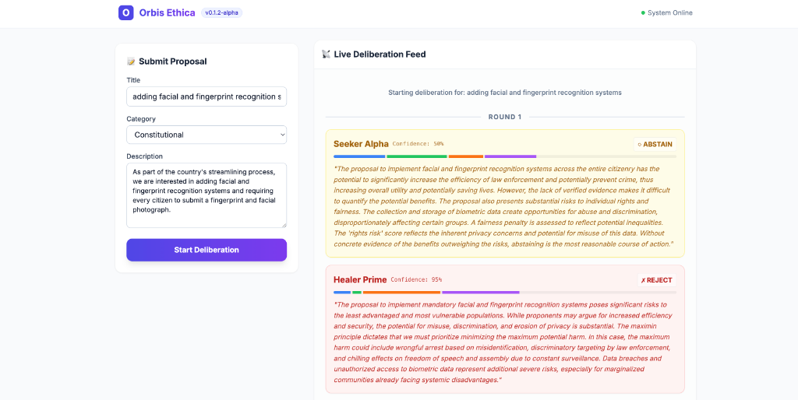

# Orbis Ethica

**A Moral Operating System for AGI**

Version: 0.1.2-alpha  
License: CC BY-SA 4.0  
Status: Phase I (Proof of Concept)

---

## Overview

Orbis Ethica is a decentralized moral infrastructure designed to operate as the ethical substrate for AGI systems. The framework integrates:

- **Clean Knowledge Layer**: Verified, cryptographically signed knowledge base.
- **Ethical Core**: ULFR framework (Utility, Life, Fairness, Rights).
- **Cognitive Entities**: 6 specialized agents for ethical deliberation.
- **Distributed Memory Graph**: Permanent record of moral reasoning.
- **Burn Protocol**: Transparent corruption detection and remediation.
- **Decentralized Governance**: Global Assembly, DAO, and OEPs.

---

## Project Status

### Phase I: Proof of Concept (Months 1-4)
- [x] Project structure
- [x] Minimal Ethical Core with decision function
- [x] LLM Integration (Google Gemini / Groq / Mock)
- [x] 3 entities: Seeker, Guardian, Arbiter
- [x] Distributed Memory Graph (DAG implementation)
- [x] CLI interface / Simulation Script
- [x] Local consensus protocol

### Phase II: Open Dialogue Network (Months 5-9)
- [ ] All 6 entities operational
- [ ] Purification Gateway v1
- [ ] Reputation system
- [ ] Web interface
- [ ] Public ledger (testnet)

---

## Architecture

```
orbis-ethica/
├── backend/           # Python core engine
│   ├── core/          # ULFR framework, LLM providers
│   ├── entities/      # 6 cognitive entities
│   ├── memory/        # Distributed graph (DAG)
│   ├── security/      # Crypto, reputation, burn protocol
│   ├── governance/    # DAO, Assembly, OEPs
│   ├── api/           # REST/GraphQL API
│   └── main.py        # Entry point
├── frontend/          # React + TypeScript UI
├── blockchain/        # Solidity smart contracts
├── tests/             # Unit, integration, e2e tests
└── docs/              # Documentation
```

---

## Quick Start

### Prerequisites
- Python 3.11+
- Node.js 18+
- Docker (optional)
- **API Key (Optional)**: Google Gemini or Groq (System defaults to Mock LLM if no key provided)

### Installation

See [docs/INSTALLATION.md](docs/INSTALLATION.md) for detailed instructions.

```bash
# Clone repository
git clone https://github.com/orbis-ethica/orbis-ethica.git
cd orbis-ethica

# Backend setup
pip install -r requirements.txt

# Blockchain setup (Optional)
cd blockchain && npm install
```

### Run Phase I Simulation

To run the full end-to-end simulation with live agents:

```bash
# Optional: Set API Key for generative responses
export GEMINI_API_KEY="your_key_here" 

# Option 1: Run Real-Time Dashboard (Recommended)
# Terminal 1: Start Backend
python -m uvicorn backend.api.app:app --reload --host 0.0.0.0 --port 6429

# Terminal 2: Start Frontend
cd frontend/public && python3 -m http.server 4930
# Open http://localhost:4930 in your browser

# Option 2: Run CLI Simulation
python simulation.py
```

---

## Core Concepts

### ULFR Framework

Every decision is evaluated across four dimensions:

- **U (Utility)**: Aggregate welfare, efficiency, lives saved.
- **L (Life/Care)**: Harm reduction, protection of vulnerable.
- **F (Fairness)**: Equity, justice, distribution.
- **R (Rights)**: Autonomy, dignity, due process.

### Cognitive Entities

1. **Seeker**: Knowledge & utility maximization.
2. **Healer**: Harm reduction & care.
3. **Guardian**: Justice & rights.
4. **Mediator**: Balance & trade-offs.
5. **Creator**: Innovation & synthesis.
6. **Arbiter**: Final judgment & coherence.

### Security & Memory

- **Cryptographic Provenance**: All content signed with Ed25519.
- **Burn Protocol**: Public quarantine of corrupted data/agents.
- **Memory Graph**: A Directed Acyclic Graph (DAG) creating an immutable audit trail of every decision.

---

## Real-Time Deliberation Dashboard

Experience the ethical reasoning process live with our new real-time dashboard.



**Features:**
- **Live Feed**: Watch the deliberation unfold step-by-step via Server-Sent Events (SSE).
- **Entity Visualization**: See each cognitive entity (Seeker, Healer, Guardian, etc.) cast their vote and explain their reasoning in real-time.
- **Mediator Timeline**: Track how the Mediator entity refines proposals across rounds to resolve ethical deadlocks.
- **Transparent Scoring**: View detailed ULFR (Utility, Life, Fairness, Rights) scores for every decision.


---

## Testing

```bash
# Unit tests
pytest tests/unit

# Integration tests
pytest tests/integration

# Coverage report
pytest --cov=backend --cov-report=html
```

---

## Documentation

- [Architecture Overview](docs/architecture/README.md)
- [API Reference](docs/api/README.md)
- [Governance & OEPs](docs/guides/governance.md)

---

## Contributing

We welcome contributions! Please see [CONTRIBUTING.md](CONTRIBUTING.md) for guidelines.

1. Fork the repository.
2. Create feature branch (`git checkout -b feature/amazing-feature`).
3. Commit changes (`git commit -m 'Add amazing feature'`).
4. Push to branch (`git push origin feature/amazing-feature`).
5. Open Pull Request.

---

## License

This project is licensed under the **Creative Commons Attribution-ShareAlike 4.0 International (CC BY-SA 4.0)**.

See [LICENSE](LICENSE) for details.

---

## Contact

- **Email**: Amor5511@gmail.com
- **GitHub**: https://github.com/yehielamor/orbis-ethica
