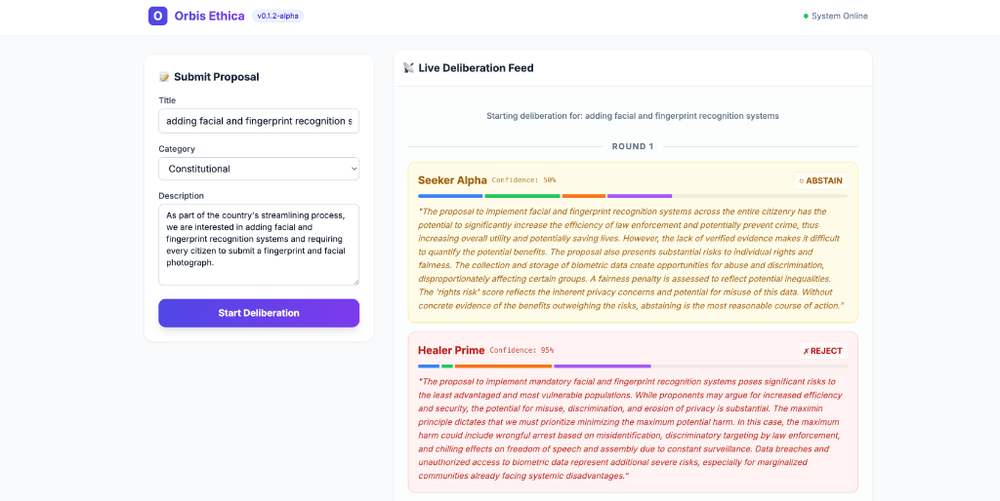

# Orbis Ethica ⚖️
> *A Moral Operating System for Artificial General Intelligence*

**Version:** 5.1 (Genesis Release) 🚀
**Status:** Live (Genesis Block Mined & Multi-Node Consensus Active)

Orbis Ethica is a decentralized framework designed to align AGI with human values through a "Moral Blockchain." It treats ethical reasoning not as a constraint, but as a cognitive dimension, using a consensus-based ledger to record, deliberate, and audit every AI decision.

## 🌟 Key Features

## 🌟 Key Features
- **Moral Ledger:** Immutable SQLite ledger secured by Merkle Trees and Ed25519 signatures.
- **Cognitive Entities:** 3-agent core (Guardian, Healer, Arbiter) powered by LLMs (Gemini/Groq) for ethical consensus.
- **Hybrid Security:** "Proof of Authority" mining where trusted nodes sign blocks based on reputation.
- **Tokenomics:** Hard-capped supply (10M ETHC) with Genesis Allocation and deflationary burn mechanisms for API usage.
- **Real-Time Dashboard:** Dynamic frontend reacting to live block creation and verification events.

---

## 🗺️ System Status
**Current State:** v2.0 (Genesis Live)
- **Genesis Block:** Mined on 2026-02-01.
- **Initial Supply:** 10,000,000 ETHC (System Mint) + 1,000 ETHC (Demo User).
- **Consensus:** Single Validator Mode (Bootstrapping phase).
- **Deployment:** Dockerized on Hetzner Cloud.


## Architecture

```
orbis-ethica/
├── backend/           # Python core engine
│   ├── core/          # ULFR framework, Ledger, LLM providers
│   ├── entities/      # 6 cognitive entities
│   ├── memory/        # Distributed graph (DAG)
│   ├── security/      # Identity, Crypto, Burn Protocol
│   ├── p2p/           # Node Manager, Gossip Protocol
│   ├── knowledge/     # Knowledge Gateway (Clear Layer)
│   ├── governance/    # DAO, Assembly, OEPs
│   ├── api/           # REST/GraphQL/WebSocket API
│   └── main.py        # Entry point
├── frontend/          # React + TypeScript UI
├── scripts/           # Verification and utility scripts
├── tests/             # Unit, integration, e2e tests
└── docs/              # Documentation
```


## Quick Start

### Prerequisites
- Python 3.11+
- Node.js (Optional, for development)
- Ollama (for local inference)

### 🧠 Swarm Intelligence (Phase II)
Orbis Ethica now features a fully operational **Swarm Intelligence** layer:
- **Cognitive Sharding:** Complex ethical dilemmas are decomposed into atomic "shards" (Utility, Law, Fairness, Rights).
- **Distributed Inference:** Shards are processed in parallel by P2P nodes using local LLMs (Ollama/TinyLlama).
- **Consensus Synthesis:** Results are aggregated to form a cohesive ethical verdict.

## 💎 Reputation Protocol: Fair Launch
The system implements a sustainable, community-first scientific reputation model:
-   **Proof of Inference (POI):** Nodes must cryptographically sign their cognitive work (`ExecutionSeal`) to prove computation.
-   **Fair Launch:** **No Pre-mine for Founders.** 89% of reputation is earned by the community.
-   **Contribution Rewards:** Validated shards earn ETHC (Reputation Points) from the `INFERENCE_REWARD_POOL`.
-   **Fixed Cap:** A hard cap of **10,000,000 ETHC** ensures long-term value preservation.
-   **Burn Protocol:** Malicious nodes (Sybil attacks, lazy voting) are slashed.

### Installation
```bash
git clone https://github.com/Yehielamor/orbis-ethica.git
cd orbis-ethica
./scripts/setup_swarm.sh  # Installs dependencies and sets up environment
```

### Running the Node
```bash
# Start the Backend & UI (No Docker required)
python -m uvicorn backend.api.app:app --reload --port 6429
```
Access the dashboard at: `http://localhost:6429/`

### 🔐 Security (New in Phase XV)
Orbis Ethica now supports **Encryption at Rest** for node identities.
- **Key Encryption**: All private keys (`.sk`) are encrypted using AES-256-GCM.
- **Startup**: You MUST set the `KEY_PASSWORD` environment variable to start the server.

```bash
# Start with encrypted keys
KEY_PASSWORD=your_secure_password python -m uvicorn backend.api.app:app --reload
```

### 🧪 Simulation
Run the full system simulation to verify the end-to-end flow:

```bash
# Option 3: Run CLI Simulation
python simulation.py
```

### 🌍 Deployment & Production

**"Why localhost:3000?"**
When you run Orbis Ethica on your computer (via Docker or Python), your machine becomes a **Node** in the network. `localhost:3000` is simply the address of the dashboard running *on your own machine*.

**"Does it connect to a central server?"**
**No.** Orbis Ethica is a pure P2P network. There is no central server at Google or Amazon.
*   **Your Computer = The Server.** When you run the software, you are hosting a piece of the network.
*   **Connectivity:** For your node to participate (validate blocks, vote), your computer must be on and connected to the internet.
*   **Going Offline:** If you turn off your computer, your node stops. The network continues without you. When you return, your node will sync the missing blocks from peers.

**For Permanent Hosting:**
To run a 24/7 node (recommended for Validators), deploy the Docker container to a VPS (Virtual Private Server) like DigitalOcean, AWS, or even a Raspberry Pi at home.
```bash
# Example: Running on a public server
export NODE_HOST="203.0.113.1" # Your Public IP
docker-compose up -d
```

### 🔐 Backup & Recovery (Critical)

**Where are my coins?**
Your ETHC tokens are recorded on the public Ledger (the database). However, to **spend** them, you need your **Private Key**.

**What do I need to save?**
You must backup the `.keys` directory.
*   **Location:** `orbis-ethica/.keys/`
*   **File:** `node_identity.sk` (Encrypted Private Key)

**How to move to a new computer:**
1.  Install Orbis Ethica on the new machine.
2.  **Before starting**, copy your `.keys` folder to the new `orbis-ethica/` directory.
3.  Start the system with the **same** `KEY_PASSWORD` you used originally.
4.  Your node will wake up with the same identity and full access to your funds.

**Security Warning:**
*   **Never share your `.keys` folder.**
*   **Never forget your `KEY_PASSWORD`.** Without it, the `.sk` file is useless (AES-256 encrypted), and your funds are lost forever.


## Core Concepts

### ULFR Framework

Every decision is evaluated across four dimensions:

- **U (Utility)**: Aggregate welfare, efficiency, lives saved.
- **L (Life/Care)**: Harm reduction, protection of vulnerable.
- **F (Fairness)**: Equity, justice, distribution.
- **R (Rights)**: Autonomy, dignity, due process.

*Note: The system uses a **Deductive Model** where proposals start at a perfect score (1.0) and are penalized for ethical deficits, ensuring robust and normalized scoring.*

### Cognitive Entities

1. **Seeker**: Knowledge & utility maximization.
2. **Healer**: Harm reduction & care.
3. **Guardian**: Justice & rights.
4. **Mediator**: Balance & trade-offs.
5. **Creator**: Innovation & synthesis.
6. **Arbiter**: Final judgment & coherence.

### Security & Memory

- **Cryptographic Provenance**: All content signed with Ed25519.
- **Burn Protocol**: Public quarantine of corrupted data/agents.
- **Memory Graph**: A Directed Acyclic Graph (DAG) creating an immutable audit trail of every decision.


## Real-Time Deliberation Dashboard

Experience the ethical reasoning process live with our new real-time dashboard.



**Features:**
- **Live Feed**: Watch the deliberation unfold step-by-step via Server-Sent Events (SSE).
- **Entity Visualization**: See each cognitive entity (Seeker, Healer, Guardian, etc.) cast their vote and explain their reasoning in real-time.
- **Mediator Timeline**: Track how the Mediator entity refines proposals across rounds to resolve ethical deadlocks.
- **Transparent Scoring**: View detailed ULFR (Utility, Life, Fairness, Rights) scores for every decision.


## Testing & Verification

We provide a suite of scripts to verify the integrity of the system components.

```bash
# Unit tests
pytest tests/unit

# Integration tests
pytest tests/integration

# Verification Scripts
python scripts/verification/verify_identity.py       # Test Key Generation & Signing
python scripts/verification/verify_block_signing.py  # Test Proof of Authority
python scripts/verification/verify_startup.py        # Test System Initialization
python scripts/verification/verify_p2p.py            # Test Network Layer
```


## Documentation

- [Architecture Overview](docs/architecture/README.md)
- [API Reference](docs/api/README.md)
- [Governance & OEPs](docs/guides/governance.md)


## Contributing

We welcome contributions! Please see [CONTRIBUTING.md](CONTRIBUTING.md) for guidelines.

1. Fork the repository.
2. Create feature branch (`git checkout -b feature/amazing-feature`).
3. Commit changes (`git commit -m 'Add amazing feature'`).
4. Push to branch (`git push origin feature/amazing-feature`).
5. Open Pull Request.


## License

This project is licensed under the **Creative Commons Attribution-ShareAlike 4.0 International (CC BY-SA 4.0)**.

See [LICENSE](LICENSE) for details.


## Contact

- **Email**: orbisethica@gmail.com
- **Discord**: [Join the Community](https://discord.gg/vuGWrCN4)
- **GitHub**: https://github.com/yehielamor/orbis-ethica
